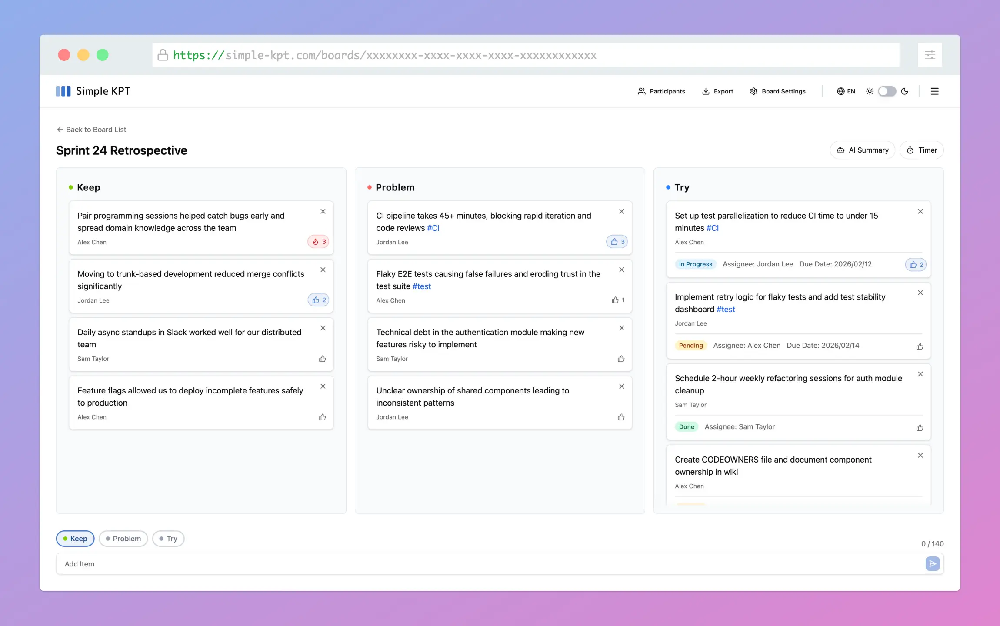

<p align="right">
  <a href="./README.md">JA</a> | EN
</p>

<div align="center">
  
  &nbsp;&nbsp;&nbsp;
  <a href="https://simple-kpt.com" target="_blank" rel="noopener">
    <picture>
      <source media="(prefers-color-scheme: dark)" srcset="./public/logotype-dark.svg">
      <source media="(prefers-color-scheme: light)" srcset="./public/logotype.svg">
      
    </picture>
  </a>
</div>

<br>

<div align="center">
  <h2>
    Make team retrospectives refreshingly simple.<br>
    Minimal preparation, minimal effort. <br>
    Focus on your retrospectives with this KPT tool.
    <br>
    <br>
  </h2>
</div>

<br>

<div align="center">
  <a href="https://simple-kpt.com/demo" target="_blank" rel="noopener">
    
  </a>
</div>

<br>

<div align="center">

[](https://github.com/hogesuke/simple-kpt/actions/workflows/ci.yml)
[](https://github.com/hogesuke/simple-kpt/blob/main/LICENSE)


</div>

<br>

<div align="center">
  <a href="https://simple-kpt.com/demo" target="_blank" rel="noopener">
    <picture>
      <source media="(prefers-color-scheme: dark)" srcset="./docs/screenshots/board-dark.webp">
      
    </picture>
  </a>
</div>

<br>

## Lighthouse Scores


## Features

- 🔄 KPT Framework
- ⏱️ Timer
- ✅ Try Progress Tracking
- 📥 Export
- 🤖 AI Summary
- 📈 Trend Charts
- 🌓 Dark Mode
- 🌐 Multilingual Support (Japanese / English)

## Tech Stack

- TypeScript
- React 19
- Tailwind CSS 4
- Zustand
- React Hook Form
- Zod
- shadcn/ui
- i18next
- Vite
- Vitest
- Playwright
- Storybook

## Infrastructure

- Supabase
- Vercel

## Requirements

- Node.js 24+

## Local Development

### Installation

```bash
pnpm install --frozen-lockfile

brew install supabase/tap/supabase
```

### Environment Variables

Create `.env.local` and set the values displayed by `supabase start`.

```bash
VITE_SUPABASE_URL=<Supabase URL> # e.g., http://127.0.0.1:54321
VITE_SUPABASE_ANON_KEY=<Supabase Anon Key> # e.g., sb_publishable_xxxxxxxx...
```

### Start

```bash
supabase start

pnpm dev
```

## Testing

```bash
# Unit tests
pnpm test

# E2E tests
pnpm e2e

# E2E tests (UI mode)
pnpm e2e:ui
```

## Storybook

### Local

```bash
pnpm storybook
```

### Public URL

https://hogesuke.github.io/simple-kpt/

## Directory Structure

```
.
├── src/
│   ├── components/   # UI Components
│   ├── contexts/     # React Context
│   ├── hooks/        # Custom Hooks
│   ├── lib/          # Utilities & API
│   ├── pages/        # Page Components
│   ├── stores/       # Zustand Stores
│   └── types/        # Type Definitions
│
└── supabase/
    ├── functions/    # Edge Functions
    ├── migrations/   # Migrations
    └── seed.sql      # Seed Data
```

## License

MIT License
