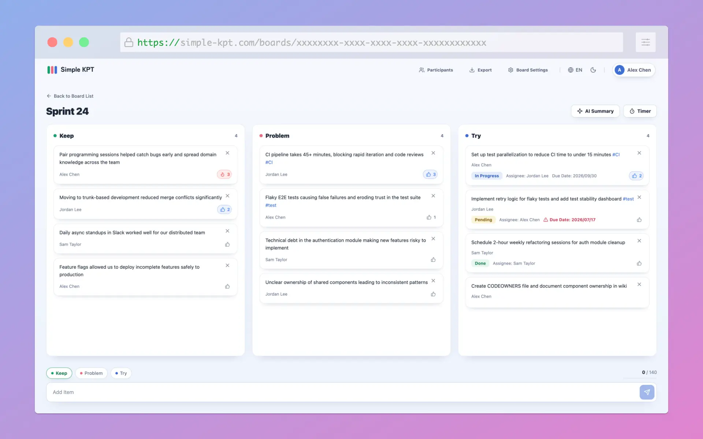

<p align="right">
  JA | <a href="./README.en.md">EN</a>
</p>

<div align="center">
  
  &nbsp;&nbsp;&nbsp;
  <a href="https://simple-kpt.com" target="_blank" rel="noopener">
    <picture>
      <source media="(prefers-color-scheme: dark)" srcset="./public/logotype-dark.svg">
      <source media="(prefers-color-scheme: light)" srcset="./public/logotype.svg">
      
    </picture>
  </a>
</div>

<br>

<div align="center">
  <h3>チームの振り返りをもっとシンプルに</h3>
  <p>準備も操作も最小限。振り返りに集中できるKPTツール</p>
</div>

<br>

<div align="center">
  <a href="https://simple-kpt.com/demo" target="_blank" rel="noopener">
    
  </a>
</div>

<br>

<div align="center">

[](https://github.com/hogesuke/simple-kpt/actions/workflows/ci.yml)
[](https://github.com/hogesuke/simple-kpt/blob/main/LICENSE)


</div>

<br>

<div align="center">
  <a href="https://simple-kpt.com/demo" target="_blank" rel="noopener">
    <picture>
      <source media="(prefers-color-scheme: dark)" srcset="./docs/screenshots/board-dark.webp">
      
    </picture>
  </a>
</div>

<br>

## Lighthouseスコア


## 機能

- 🔄 KPTフレームワーク
- ⏱️ タイマー
- ✅ Tryの進捗管理
- 📥 エクスポート
- 🤖 AIサマリー
- 📈 推移のグラフ表示
- 🌓 ダークモード
- 🌐 多言語対応（日本語 / English）

## 技術スタック

- TypeScript
- React 19
- Tailwind CSS 4
- Zustand
- React Hook Form
- Zod
- shadcn/ui
- i18next
- Vite
- Vitest
- Playwright
- Storybook

## 実行環境

- Supabase
- Vercel

## 動作確認環境

- Node.js 24+

## ローカル開発

### インストール

```bash
pnpm install --frozen-lockfile

brew install supabase/tap/supabase
```

### 環境変数の設定

`.env.local`を作成し、`supabase start`で表示される値を設定してください。

```bash
VITE_SUPABASE_URL=<Supabase URL> # e.g., http://127.0.0.1:54321
VITE_SUPABASE_ANON_KEY=<Supabase Anon Key> # e.g., sb_publishable_xxxxxxxx...
```

### 起動

```bash
supabase start

pnpm dev
```

## テスト

```bash
# ユニットテスト
pnpm test

# E2Eテスト
pnpm e2e

# E2Eテスト (UIモード)
pnpm e2e:ui
```

## Storybook

### ローカル起動

```bash
pnpm storybook
```

### 公開URL

https://hogesuke.github.io/simple-kpt/

## ディレクトリ構成

```
.
├── src/
│   ├── components/   # UIコンポーネント
│   ├── contexts/     # React Context
│   ├── hooks/        # カスタムフック
│   ├── lib/          # ユーティリティ・API
│   ├── pages/        # ページコンポーネント
│   ├── stores/       # Zustandストア
│   └── types/        # 型定義
│
└── supabase/
    ├── functions/    # Edge Functions
    ├── migrations/   # マイグレーション
    └── seed.sql      # シードデータ
```

## ライセンス

MIT License
